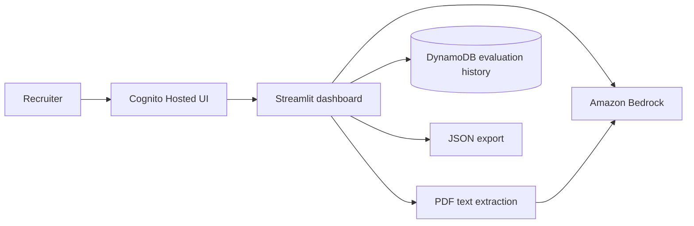

# CV Screener & Evaluator

> A focused workspace for comparing a candidate's CV with a job description using Amazon Bedrock.

[](https://www.python.org/)
[](https://streamlit.io/)
[](https://aws.amazon.com/)

CV Screener is a serverless application for recruiters and hiring teams. It extracts text from PDF resumes, evaluates the evidence against a role brief, and stores each result so an authenticated user can review it later.

## What It Does

- Sign in with Amazon Cognito Hosted UI.
- Upload a selectable-text PDF resume.
- Compare the resume with a job description.
- Generate a structured fit score with strengths, gaps, and a summary.
- Save evaluation history per Cognito account.
- Download an evaluation as JSON.
- Review the extracted CV evidence before making a hiring decision.

## Architecture



The planned AWS services are:

| Service | Responsibility |
| --- | --- |
| Amazon Cognito | Account registration, login, email verification, and tokens |
| Streamlit | Local dashboard and review workflow |
| Amazon Bedrock | CV and job-description evaluation |
| DynamoDB | Per-user evaluation history |
| Amazon S3 | CV file storage in the serverless workflow |
| AWS Lambda | Event-driven processing |
| Amazon Textract | PDF text extraction in the serverless workflow |

## Project Structure

```text
backend/
  bedrock.py          # Bedrock Converse API and response validation
  config.py           # Environment configuration
  handler.py          # S3-triggered Lambda starter
  history.py          # DynamoDB history access
  pdf_extractor.py    # PDF text extraction
frontend/
  app.py              # Streamlit dashboard
prompts/
  cv_evaluation.txt   # Evaluation prompt and JSON contract
tests/
  test_history.py
  test_prompting.py
template.yaml          # AWS SAM infrastructure
requirements.txt       # Python dependencies
```

## Quick Start

### 1. Create the environment

```bash
python3 -m venv .venv
source .venv/bin/activate
python -m pip install -r requirements.txt
cp .env.example .env
```

Use the AWS credential chain for credentials. Do not put access keys in `.env`:

```bash
aws configure
```

### 2. Configure environment variables

For `ap-southeast-1`, use an inference profile rather than the direct on-demand model ID:

```dotenv
AWS_REGION=ap-southeast-1
CV_BUCKET_NAME=your-bucket-name
CV_RESULTS_TABLE=cv-evaluations
BEDROCK_MODEL_ID=apac.amazon.nova-lite-v1:0
```

Check available profiles with:

```bash
aws bedrock list-inference-profiles \
  --region ap-southeast-1 \
  --query "inferenceProfileSummaries[?contains(inferenceProfileId, 'nova')].[inferenceProfileId,status]" \
  --output table
```

### 3. Configure Cognito OIDC

Create `.streamlit/secrets.toml` locally. This file is ignored by Git.

```toml
[auth]
redirect_uri = "http://localhost:8501/oauth2callback"
cookie_secret = "PASTE_OUTPUT_OF_OPENSSL_RAND_HERE"

[auth.cognito]
client_id = "COGNITO_APP_CLIENT_ID"
client_secret = ""
server_metadata_url = "https://cognito-idp.ap-southeast-1.amazonaws.com/USER_POOL_ID/.well-known/openid-configuration"
```

Generate a cookie secret:

```bash
mkdir -p .streamlit
openssl rand -hex 32
```

The Cognito app client must allow:

- OAuth flow: `code`
- OAuth scopes: `openid`, `email`, `profile`
- Callback URL: `http://localhost:8501/oauth2callback`
- Logout URL: `http://localhost:8501`

Replace every placeholder with a real value. A placeholder in the metadata URL causes a Cognito `400 Bad Request`.

### 4. Run the dashboard

```bash
.venv/bin/streamlit run frontend/app.py --server.port 8501
```

Open <http://localhost:8501>, choose **Sign in with Amazon Cognito**, then create an account with an email address. Cognito will send a verification code.

## Evaluation History

Each evaluation is saved with the authenticated Cognito `sub` as `user_id`, so users only see their own history.

The currently deployed table uses this primary key:

```text
Partition key: job_id       String
Sort key:      candidate_id String
```

New records also include `user_id`, `created_at`, candidate details, score, summary, strengths, gaps, and job description. The current reader uses a filtered scan because the deployed table predates the per-user key design. For production scale, add a DynamoDB GSI on `user_id` and `created_at`, then switch the reader to `Query`.

## Development Checks

```bash
.venv/bin/python -m pytest -q
.venv/bin/python -m py_compile backend/*.py frontend/app.py
```

The tests run locally and do not call AWS services.

## Troubleshooting

| Error | Fix |
| --- | --- |
| `ModuleNotFoundError: backend` | Run Streamlit from the project root using the command above. |
| `StreamlitMissingAuthlibError` | Run `.venv/bin/python -m pip install 'streamlit[auth]'`. |
| `Client is not enabled for OAuth2.0 flows` | Enable the Cognito authorization-code flow and OAuth client flag. |
| Cognito metadata returns `400` | Replace `USER_POOL_ID` with the real Cognito User Pool ID. |
| `Query condition missed key schema element: job_id` | The deployed table requires `job_id` and `candidate_id`; use the current history adapter or add a GSI. |
| `Decimal is not JSON serializable` | DynamoDB numbers are `Decimal`; the dashboard converts them for JSON download. |
| Bedrock on-demand model error | Use an active regional inference profile such as `apac.amazon.nova-lite-v1:0`. |
| Bedrock daily token quota error | Wait for reset or request a quota increase in AWS Service Quotas. |

## Security Notes

- Never commit `.env` or `.streamlit/secrets.toml`.
- Never store Cognito passwords in DynamoDB.
- Use Cognito `sub` as the stable account identifier.
- Review IAM permissions before deploying `template.yaml`.
- CVs contain personal data. Restrict access and define a retention policy.
